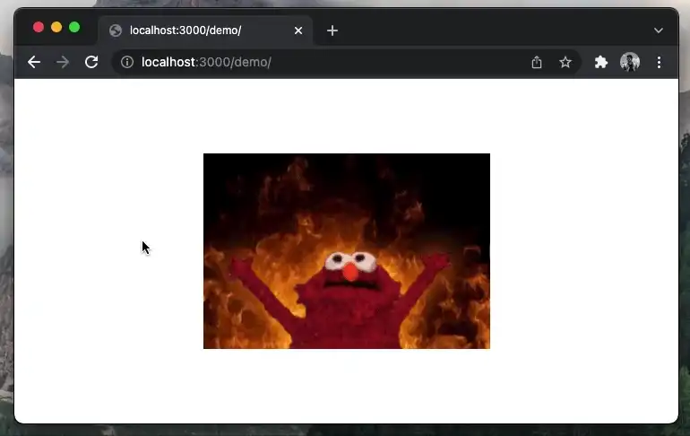

# GIFSane

Converts GIFs to sane controllable embed video players ~Basically does something browsers should do natively~.
If your favourite platform doesn't convert user GIFs into videos, this extension will help you.

## Install

Due to the usage of WASM, is a bit tricky to upload this extension into web extension stores.

- Chrome and other Chromium browsers
  - Go to `chrome://extensions/`
  - Enable the `Developer mode` (toggle on top right corner)
  - `Load unpacked` and point to the extension folder

- Firefox:
  - Run `npm run link:firefox` (or run the script present on the `package.json` script for this task)
  - Go to `about://debugging/`
  - `Load temporary add-on...` and point to the extension `manifest.json`

## Try it out

Here is a short GIF you can try to convert once you install the extension. You should see a `Convert` button on the bottom left corner.

## Caveats

- It uses `ffmpeg.wasm`, which is quite slow for long videos
- It uses Manifest V2 because some WASM CSP directives are not implemented and `ffmpeg.wasm` uses `document` selectors within its code. To port it to Manifest V3, the code will need to be placed in a worker which doesn't have access to the DOM (`document`).
- It can't be published on Chrome Store due to Manifest V2 :)
- It will stop working in January 2023 in Chrome if this can't be ported to Manifest V3.

## To-do

- Add support to sending to a remote server
- Write down landing page
- Try to replace FFMPEG with something else?
- Deal with `.webp` (ffmpegwasm doesn't seem to like those)
